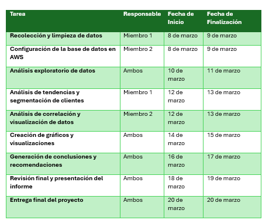
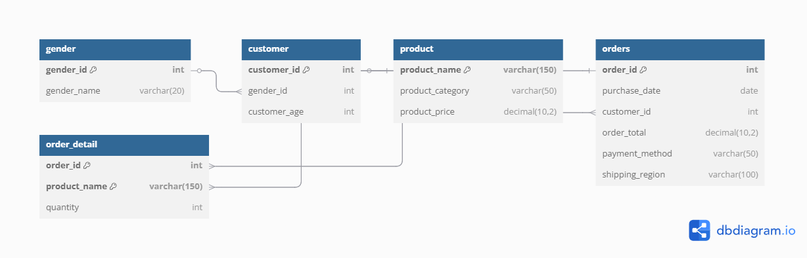

# Practica 1 Sistemas Organizacionales y Gerenciales 2


#### Integrantes

|Nombre                             |Carnet        |
|-----------------------------------|--------------|
|Luis David Garcia Alay             |201612511     |
|Eliezer Abraham Zapeta Alvarado	|201801719     |


# Documentación

## PLANIFICACIÓN
- **Inicio:** 8 de marzo
- **Finalización prevista:** 20 de marzo
- **Equipo:** 
    - Eliezer Abraham Zapeta Alvarado (Miembro 1)
    - Luis David Garcia Alay (Miembro 2)

### División de Tareas entre los Miembros del Equipo



### Herramientas y Tecnologías Utilizadas, Proyecto: Análisis de Ventas en Línea
- **Lenguaje de programación:** Python
- **Base de datos:** Google SQL (MySQL)
- **Bibliotecas para análisis y visualización:**
    - Pandas (Manejo de datos)
    - Matplotlib y Seaborn (Visualización)
    - Scikit-learn (Análisis de correlación)
- **Entorno de desarrollo:** Python / VS Code
- **Control de versiones:** GitHub

**Razón de elección:**
- **Python:** Fácil manejo de datos y amplia compatibilidad con bibliotecas de análisis.
- **Google SQL (MySQL):** Permite escalabilidad y acceso remoto a la base de datos.
- **Matplotlib y Seaborn:** Facilitan la generación de gráficos detallados.

### Establecimiento de Plazos

Fases del Proyecto y Cronograma

* 📅 Semana 1 (8 - 12 de marzo):
    - Preparación de datos (extracción, limpieza y carga en Google SQL).
    - Exploración inicial de los datos.
    - 3 Horas planificadas

* 📅 Semana 2 (13 - 17 de marzo):
    - Análisis de tendencias y segmentación de clientes.
    - Identificación de correlaciones y generación de gráficos.
    - Generación de conclusiones y recomendaciones.
    - 10 Horas planificadas

* 📅 Semana 3 (18 - 20 de marzo):
    - Revisión y optimización del código.
    - Preparación del informe final y presentación.
    - Entrega del proyecto el 20 de marzo.
    - 4 Horas planificadas

--------------------------------------------------------
## PROCESO DE ANALISIS
#### Manual de Análisis de Datos: Ventas en Línea

### **Enfoque Paso a Paso para la Limpieza y Preparación de los Datos**

**Fuente:** Archivo CSV `ventas_tienda_online.csv`  
**Acción:** Se cargaron los datos en un DataFrame de Pandas utilizando:

```python
import pandas as pd
df = pd.read_csv("ventas_tienda_online.csv")
```

* **Paso 1:** Conversión de Tipos de Datos

    - Se convierte la columna purchase_date a tipo datetime usando pd.to_datetime con errors='coerce' para que los valores inválidos se transformen en NaT.
    
    - Se transforman las columnas product_price y order_total a numérico mediante pd.to_numeric con errors='coerce', reemplazando valores no convertibles por 0 y redondeando a 4 decimales.

    ```python
    df['purchase_date'] = pd.to_datetime(df['purchase_date'], errors='coerce')
    df['product_price'] = pd.to_numeric(df['product_price'], errors='coerce').fillna(0).round(4)
    df['order_total'] = pd.to_numeric(df['order_total'], errors='coerce').fillna(0).round(4)
    ```

* **Paso 2:** Limpieza de Valores Categóricos y Nulos
    
    - En la columna customer_gender, se reemplazan valores como "0", "-", "", pd.NA y None por "Sin definir".

    - Para customer_age, se sustituyen valores inválidos (como "0", "-", "", pd.NA, None) por 0.

    - Se reemplazan valores en product_name y product_category por "Sin definir" cuando sean vacíos o inválidos.

    - En payment_method, se reemplazan valores vacíos o nulos por "Sin definir".

    - Para quantity, se sustituyen valores como "0", "-", "", pd.NA y None por 0.

    ```python
    df['customer_gender'] = df['customer_gender'].replace(["0", "-", "", pd.NA, None], "Sin definir")
    df['customer_age'] = df['customer_age'].replace(["0", "-", "", pd.NA, None], 0)
    df['product_name'] = df['product_name'].replace(["0", "-", "", pd.NA, None], "Sin definir")
    df['product_category'] = df['product_category'].replace(["0", "-", "", pd.NA, None], "Sin definir")
    df['payment_method'] = df['payment_method'].replace(["", pd.NA, None], "Sin definir")
    df['quantity'] = df['quantity'].replace(["0", "-", "", pd.NA, None], 0)
    ```

* **Paso 3:** Preparación de Dimensiones para la Carga en la Base de Datos

    - Se genera la dimensión de géneros (dim_gender) eliminando duplicados y asignando un identificador único.

    - Para la dimensión de clientes (dim_customer), se selecciona la última fecha de compra de cada cliente y se asigna el identificador de género correspondiente.

    - Se extraen las dimensiones de productos (dim_product), órdenes (dim_order) y detalles de órdenes (dim_order_detail) eliminando duplicados según corresponda.

    ```python
    # Dimensión de género
    dim_gender = df[['customer_gender']].drop_duplicates().copy()
    dim_gender['gender_id'] = range(1, len(dim_gender) + 1)

    # Dimensión de clientes: se selecciona la última fecha de compra para cada cliente
    dim_customer = df[['customer_id', 'customer_gender', 'customer_age', 'purchase_date']].drop_duplicates().copy()
    dim_customer = dim_customer.loc[dim_customer.groupby('customer_id')['purchase_date'].idxmax()]
    dim_customer['gender_id'] = dim_customer['customer_gender'].map(dim_gender.set_index('customer_gender')['gender_id'])

    # Dimensión de productos
    dim_product = df[['product_name', 'product_category', 'product_price']].drop_duplicates().copy()
    dim_product = dim_product.drop_duplicates(subset=['product_name'])
    ```

* **Resultado:**

    - Con estos pasos, los datos se limpian y preparan de forma que tengan los tipos de datos correctos y valores consistentes. Además, se generan las dimensiones necesarias para proceder a la carga de datos en la base de datos relacional.
    ```python
    return dim_gender, dim_customer, dim_product, dim_order, dim_order_detail
    ```
------------------------------------------------------------

### **Decisiones Tomadas Durante el Análisis Exploratorio de Datos**  
---
* **Análisis Inicial**  
    - Se calcularon **estadísticas básicas**:
    ```python
    print(df.describe())
    ```

* Se realizaron **visualizaciones** para identificar patrones:
    - **Ventas por categoría de producto**
    - **Ventas por región**
    - **Tendencias de ventas por mes**

* **Decisiones Claves:**
    1. Segmentación de clientes por edad (`0-18`, `19-25`, `26-35`, etc.).
    2. Identificación de productos más vendidos.
    3. Relación entre métodos de pago y categorías de productos.
    4. Determinación de meses con mayores y menores ventas.
---
### **Desafíos Encontrados y Cómo Fueron Superados**  
---
1. **Datos Incompletos o Nulos**
    - **Problema:** Algunas columnas tenían valores faltantes.
    - **Solución:** Se rellenaron con valores estadísticos (moda, mediana, media).  

---
2. **Formato de Fechas Incorrecto**  
    - **Problema:** `purchase_date` estaba en un formato no estándar.  
    - **Solución:** Se convirtió a `datetime` con `dayfirst=True`.  

---
3. **Volumen de Datos y Tiempo de Procesamiento**  
    - **Problema:** Algunas consultas demoraban demasiado al analizar tendencias.  
    - **Solución:** Se optimizaron cálculos con `groupby()` y `sum()`.  

```python
df.groupby('month')['order_total'].sum()
```

---
4. **Visualización de Datos con Categorías Mixtas**  
    - **Problema:** Algunas categorías tenían muchas subcategorías, dificultando la visualización.  
    - **Solución:** Se agruparon y se usaron gráficos de **barras y dispersión**.

```python
import seaborn as sns
sns.barplot(x=df['product_category'], y=df['order_total'], estimator=sum)
```

---
5. Análisis de Correlación**  
    - **Problema:** No se podía calcular correlación directamente entre `product_category` y `payment_method`.
    - **Solución:** Se usaron gráficos de **conteo (`sns.countplot()`)**.

```python
sns.countplot(x=df['product_category'], hue=df['payment_method'])
```


--------------------------------------
## METODOLOGÍA

### Selección de Visualizaciones en el Análisis de Datos
Se describe la metodología utilizada para seleccionar las visualizaciones más apropiadas en el análisis de los datos de ventas en línea. La selección de gráficos se basó en la naturaleza de los datos y el tipo de información que se quería comunicar.

### **Criterios para la Selección de Visualizaciones**

Para elegir las visualizaciones, consideramos los siguientes factores:

- **Tipo de variable**: Numérica o categórica.
- **Objetivo del análisis**: Comparación, distribución, tendencia o correlación.
- **Claridad y facilidad de interpretación**: La visualización debía ser comprensible para diferentes públicos.

### **Tipos de Visualizaciones y su Justificación**

| **Tipo de Gráfico** | **Uso en el Proyecto** | **Justificación** |
|--------------------|---------------------|------------------|
| **Gráfico de Barras** | Ventas por categoría de producto y región | Permite comparar valores categóricos de manera clara y rápida. |
| **Gráfico de Líneas** | Tendencia de ventas por mes | Muestra la evolución de las ventas en el tiempo, identificando picos y bajas. |
| **Gráfico de Dispersión** | Relación entre edad del cliente y total de la orden | Facilita la detección de patrones y correlaciones entre dos variables numéricas. |
| **Gráfico de Barras Apiladas** | Método de pago por categoría de producto | Permite ver la distribución de métodos de pago dentro de cada categoría. |
| **Gráfico de Pastel** | Distribución de ventas por género | Ayuda a visualizar proporciones de una variable categórica. |
| **Gráfico de Histogramas** | Distribución de edades de los clientes | Muestra la frecuencia de valores dentro de rangos específicos. |
| **Heatmap (Mapa de Calor)** | Matriz de correlación entre variables numéricas | Resalta relaciones entre múltiples variables de forma visualmente efectiva. |


### **Aplicación de Visualizaciones en el Análisis**

#### **1. Comparación de Ventas por Categoría de Producto**
- **Visualización utilizada:** Gráfico de Barras  
- **Motivo:** Permite comparar rápidamente las ventas entre categorías.

```python
import seaborn as sns
import matplotlib.pyplot as plt

plt.figure(figsize=(12, 6))
sns.barplot(x=df['product_category'], y=df['order_total'], estimator=sum, ci=None)
plt.title("Ventas por Categoría de Producto")
plt.xlabel("Categoría")
plt.ylabel("Total de Ventas")
plt.xticks(rotation=45)
plt.show()
```

---

#### **2. Tendencia de Ventas por Mes**
- **Visualización utilizada:** Gráfico de Líneas  
- **Motivo:** Muestra la evolución de las ventas en el tiempo.

```python
df['month'] = df['purchase_date'].dt.month_name()
ventas_por_mes = df.groupby('month')['order_total'].sum()

plt.figure(figsize=(12, 6))
plt.plot(ventas_por_mes.index, ventas_por_mes.values, marker='o', linestyle='-')
plt.title("Tendencia de Ventas por Mes")
plt.xlabel("Mes")
plt.ylabel("Total de Ventas")
plt.xticks(rotation=45)
plt.show()
```

#### **3. Relación entre Edad del Cliente y Total de la Orden**
- **Visualización utilizada:** Gráfico de Dispersión  
- **Motivo:** Permite visualizar tendencias y correlaciones.

```python
plt.figure(figsize=(8, 6))
sns.scatterplot(x=df['customer_age'], y=df['order_total'], alpha=0.5)
plt.title("Relación entre Edad y Total de la Orden")
plt.xlabel("Edad del Cliente")
plt.ylabel("Total de la Orden")
plt.show()
```


#### **4. Método de Pago Preferido por Categoría de Producto**
- **Visualización utilizada:** Gráfico de Barras Apiladas  
- **Motivo:** Muestra la distribución de métodos de pago en cada categoría.

```python
plt.figure(figsize=(12, 6))
sns.countplot(x=df['product_category'], hue=df['payment_method'])
plt.title("Método de Pago por Categoría de Producto")
plt.xlabel("Categoría")
plt.ylabel("Frecuencia")
plt.xticks(rotation=45)
plt.legend(title="Método de Pago")
plt.show()
```
---
### MODELO ENTIDAD RELACIÓN
---
* Diagrama



* Diagrama db


### **CONCLUSIONES**

#### Variedad de métodos de pago equilibrada
- El uso de efectivo, transferencia bancaria, tarjeta de crédito y PayPal está distribuido casi de manera uniforme. Esto indica que los clientes no tienen una preferencia dominante y valoran la disponibilidad de múltiples métodos de pago.

#### Ventas equilibradas por categoría de producto
- Si bien la categoría Ropa muestra un ligero liderazgo en ventas totales, Calzado y Accesorios también presentan cifras muy cercanas. Esto sugiere que los clientes compran de forma bastante uniforme en todas las categorías.

#### Segmento de mayor edad con mayor volumen de ventas
- El grupo de clientes de 61+ años aporta el volumen de ventas más alto, superando a los grupos de menor edad. Esto puede significar que los clientes de mayor edad realizan compras más frecuentes o de mayor valor, representando una oportunidad de mercado importante.

#### Estacionalidad y correlación débil con la edad
- La tendencia de ventas por mes muestra picos en ciertos periodos (p. ej., mayo, julio) y caídas notables (p. ej., agosto).

- La correlación entre la edad del cliente y el total de la orden es débil, lo que implica que la edad no es un factor determinante en el gasto por pedido, aunque el volumen total de ventas sea más alto en el segmento de mayor edad.

-----------------------
## **RECOMENDACIONES**

### Estudiante 1: Luis David Garcia Alay
#### Enfoque de marketing segmentado por edad

- Dado que el segmento de 61+ años representa el mayor volumen de ventas, conviene diseñar campañas de marketing y promociones específicas para este grupo, ofreciendo productos o descuentos que se ajusten a sus preferencias y aumentando su fidelización.

#### Mantener y promover múltiples métodos de pago

La adopción equilibrada de diferentes métodos de pago sugiere que los clientes aprecian la flexibilidad. Continuar ofreciendo diversas opciones (e incluso evaluar nuevos métodos, como pagos móviles) puede mejorar la experiencia de compra y facilitar un mayor ticket promedio.


### Estudiante 2: Eliezer Abraham Zapeta Alvarafo

#### Aprovechar la estacionalidad

- Reforzar promociones en meses de ventas bajas (p. ej., agosto) para estimular la demanda, ya sea con ofertas especiales, lanzamientos de productos o campañas publicitarias.

- Preparar inventario y personal adicional en los meses con picos de ventas (p. ej., mayo, julio) para satisfacer la demanda y evitar rupturas de stock o demoras.

#### Impulsar ventas cruzadas entre categorías

- Dado que las categorías Ropa, Calzado y Accesorios presentan ventas similares, se pueden crear combos o bundles que integren artículos de diferentes categorías, incentivando compras más completas.

- También se pueden lanzar programas de fidelización que ofrezcan beneficios al adquirir productos de distintas categorías, maximizando así el valor promedio de cada cliente.
 


-----------------
# Respuestas a las preguntas claves de la practica

## a. ¿Cómo podrían los insights obtenidos ayudar a diferenciarse de la competencia?
Los datos revelan patrones específicos en el comportamiento de los clientes—por ejemplo, la diversidad en métodos de pago, la segmentación por edad y género, y la estacionalidad en las ventas. Estos insights permiten a la empresa:

- **Personalizar la oferta:** Conocer qué segmentos (como el grupo de mayor edad) generan más ventas o cuáles son las categorías más demandadas permite diseñar promociones y servicios a medida.

- **Optimizar la experiencia de compra:** Ofrecer múltiples opciones de pago y servicios alineados con las preferencias detectadas (como bundles entre categorías complementarias) ayuda a mejorar la percepción del cliente, diferenciándose por calidad y adaptabilidad.

- **Responder rápidamente a tendencias:** La identificación de picos y caídas en ventas permite implementar estrategias de respuesta rápida, lo cual es difícil de igualar para la competencia que no cuenta con análisis de datos en tiempo real.

Luis David Garcia Alay:
- Permiten personalizar la oferta y mejorar la experiencia de compra, facilitando campañas dirigidas y respuestas ágiles ante tendencias del mercado.

Eliezer Abraham Zapeta Alvarado:
- La identificación de patrones en métodos de pago y comportamientos de compra permite diseñar estrategias que optimicen el servicio y fidelicen a los clientes.

## b. ¿Qué decisiones estratégicas podrían tomarse basándose en este análisis para aumentar las ventas y la satisfacción del cliente?
Algunas decisiones estratégicas basadas en el análisis podrían ser:

- **Segmentación y campañas dirigidas:** Enfocar esfuerzos de marketing en los segmentos más rentables (por ejemplo, el grupo de clientes de 61+ años) y adaptar la comunicación para diferentes grupos demográficos.

- **Promociones estacionales:** Planificar campañas especiales en los meses de menor venta para incentivar la demanda y aprovechar los picos identificados para maximizar ventas.

- **Bundles y cross-selling:** Diseñar ofertas que combinen productos de categorías relacionadas (ropa, calzado, accesorios) para incentivar compras mayores.

- **Mejorar la experiencia de compra digital:** Asegurarse de que la variedad de métodos de pago y la interfaz de compra sean óptimos, lo que puede aumentar la satisfacción y fidelidad del cliente.

Luis David Garcia Alay:
- Implementar campañas segmentadas, promociones estacionales y bundles de productos para aumentar el ticket promedio y la satisfacción del cliente.

Eliezer Abraham Zapeta Alvarado:
- Ajustar la estrategia de marketing según los segmentos rentables y optimizar la experiencia digital para captar la preferencia de distintos grupos demográficos.

## c. ¿Cómo podría este análisis de datos ayudar a la empresa a ahorrar costos o mejorar la eficiencia operativa?
El análisis permite optimizar recursos y procesos internos al:

- **Ajustar inventario y logística:** Al identificar periodos de alta y baja demanda, la empresa puede planificar mejor su stock, evitando tanto el exceso de inventario como la falta de productos.

- **Optimizar la asignación de personal:** Conociendo las tendencias estacionales, se puede gestionar el personal de manera eficiente, incrementando la capacidad operativa en momentos críticos y reduciéndola en periodos tranquilos.

- **Reducir costos de marketing:** Al enfocar las campañas en segmentos y periodos específicos, se optimiza la inversión publicitaria, dirigiendo recursos a acciones con mayor probabilidad de conversión.

- **Mejorar procesos internos:** La detección de ineficiencias (por ejemplo, en la cadena de suministro o en el proceso de atención al cliente) permite implementar mejoras que reduzcan costos operativos a largo plazo.

Luis David Garcia Alay:
- Permite optimizar la gestión de inventario y logística, evitando excesos o faltantes y reduciendo costos operativos.

Eliezer Abraham Zapeta Alvarado:
- Un análisis detallado ayuda a ajustar procesos internos y la asignación de personal según la demanda, mejorando la eficiencia y reduciendo costos.

## d. ¿Qué datos adicionales recomendarían recopilar para obtener insights aún más valiosos en el futuro?
Para profundizar en el análisis y obtener una visión más completa, se podrían recopilar los siguientes datos adicionales:

- **Datos de comportamiento en el sitio web:** Información sobre la navegación, tiempo de permanencia, embudos de conversión y páginas visitadas para identificar puntos de fuga o áreas de mejora en la experiencia de usuario.

- **Retroalimentación del cliente:** Encuestas de satisfacción, comentarios, reseñas y datos de atención al cliente que permitan evaluar la percepción del servicio y detectar áreas de oportunidad en productos o procesos.

- **Datos demográficos y geográficos detallados:** Información como ubicación precisa, nivel socioeconómico, y preferencias culturales que permitan segmentar aún más a los clientes y personalizar ofertas.

- **Información de la competencia y del mercado:** Datos sobre precios, promociones y tendencias de consumo en el sector, para poder ajustar la estrategia en función del entorno competitivo.

- **Datos de campañas publicitarias y ROI:** Información sobre la efectividad de las acciones de marketing (costos, conversiones, retorno de inversión) que ayuden a optimizar futuras inversiones publicitarias.

Luis David Garcia Alay:
- Recopilar datos sobre el comportamiento en el sitio web, retroalimentación directa del cliente y métricas de campañas publicitarias para enriquecer el análisis.

Eliezer Abraham Zapeta Alvarado:
- Recabar información demográfica y geográfica más detallada, además de datos sobre la competencia y el mercado, para permitir una segmentación y estrategias más precisas.
-----------
