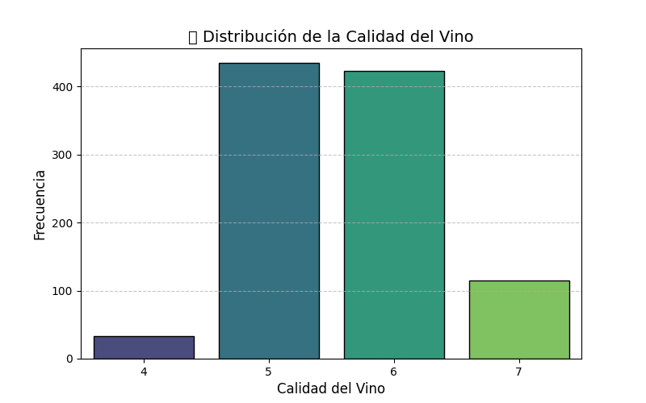
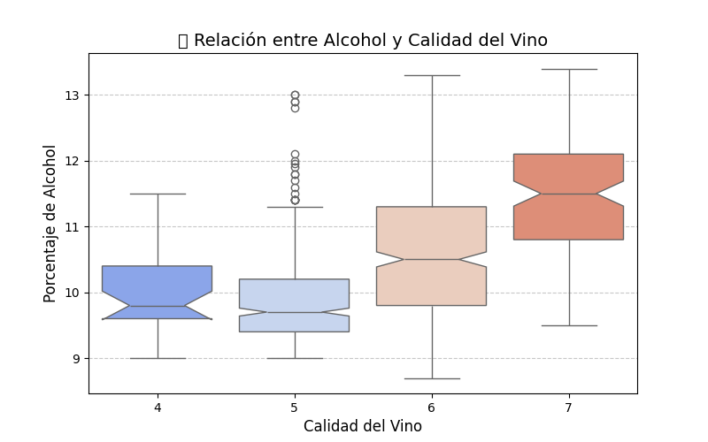
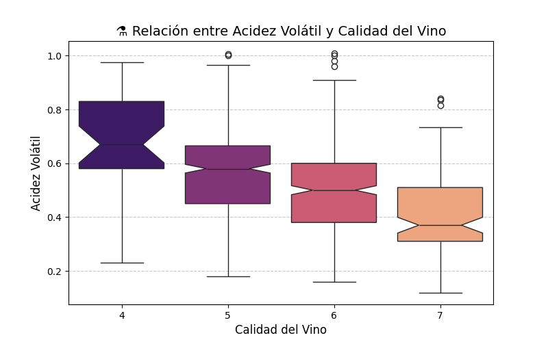
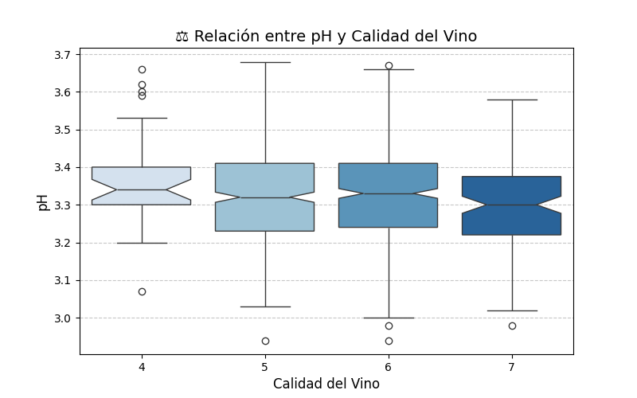
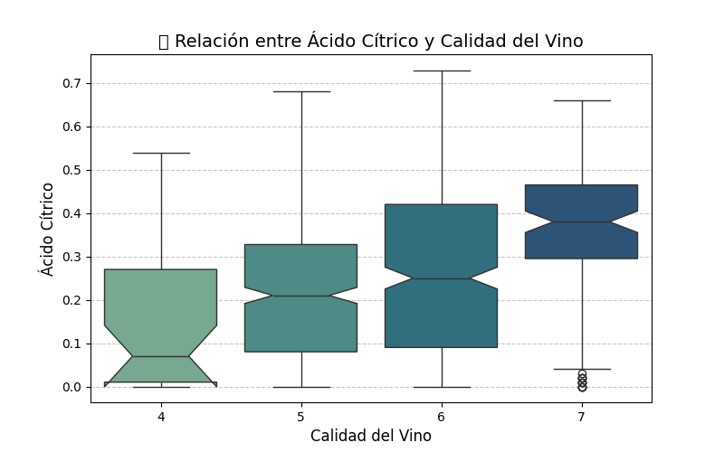
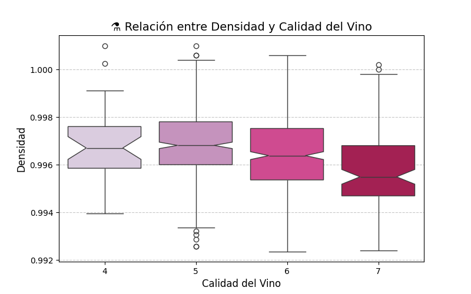
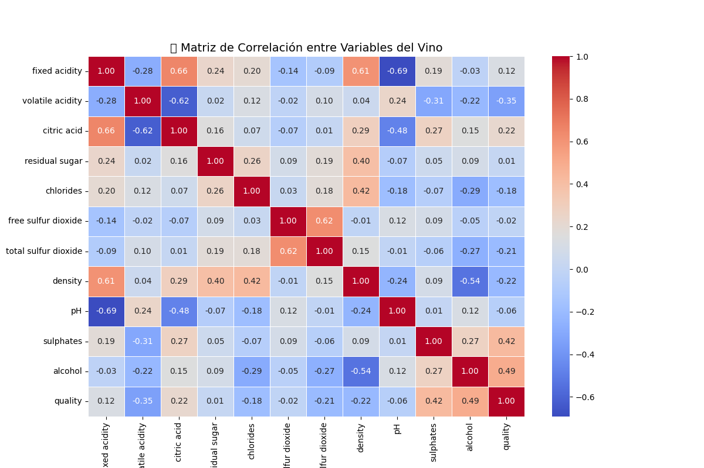

# Análisis de la Calidad del Vino

## Carga y Limpieza de Datos

- No se encontraron valores nulos, por lo que no fue necesario rellenarlos.
- Se identificaron y eliminaron filas duplicadas.
- Se detectaron y eliminaron valores atípicos basados en el método IQR, sin que haya quedado ningún valor significativo fuera de rango.
- La columna 'quality' fue convertida a tipo entero para su correcta representación.

## Resumen Estadístico
El análisis de las características del vino, después de la limpieza de los datos, mostró las siguientes estadísticas clave:
- La calidad del vino presenta valores entre 4 y 7, con una distribución ligeramente sesgada hacia valores más altos de calidad.
- La variable 'alcohol' tiene una correlación moderada de 0.49 con la calidad.
- La variable 'acidez volátil' tiene una correlación negativa de -0.35 con la calidad.
- La variable 'pH' muestra una correlación de -0.06 con la calidad.
- La variable 'ácido cítrico' tiene una correlación positiva moderada de 0.22 con la calidad.
- La variable 'densidad' tiene una correlación de -0.22 con la calidad.

## Clonclusiones correlaciones tomadas en cuenta
Las siguientes correlaciones fueron observadas entre la variable 'quality' y otras características del vino:

- **Alcohol**: 0.49 (correlación moderada positiva)
- **Acidez Volátil**: -0.35 (correlación negativa)
- **pH**: -0.06 (correlación muy baja negativa)
- **Ácido Cítrico**: 0.22 (correlación moderada positiva)
- **Densidad**: -0.22 (correlación moderada negativa)

## Gráficos
Se generaron los siguientes gráficos para ilustrar las relaciones entre las variables y la calidad del vino:

- **Gráfico 1: Distribución de la Calidad del Vino**  
  Se observó una distribución de la calidad del vino con frecuencias más altas en ciertas calidades..  
  

- **Gráfico 2: Relación entre Alcohol y Calidad del Vino**  
  La correlación entre alcohol y calidad es de 0.49.  
  

- **Gráfico 3: Relación entre Acidez Volátil y Calidad del Vino**  
  La correlación entre acidez volátil y calidad es de -0.35.  
  

- **Gráfico 4: Relación entre pH y Calidad del Vino**  
  La correlación entre pH y calidad es de -0.06.  
  

- **Gráfico 5: Relación entre Ácido Cítrico y Calidad del Vino**  
  La correlación entre ácido cítrico y calidad es de 0.22.  
  

- **Gráfico 6: Densidad vs Calidad del Vino**  
  La correlación entre densidad y calidad es de -0.22.  
  

- **Gráfico 7: Matriz de Correlación**  
  La matriz muestra las correlaciones entre todas las variables del conjunto de datos, destacando la relación de cada una con la calidad.  
  

## otras conclusiones
- El alcohol es un factor relevante para determinar la calidad del vino, con los vinos de mayor alcohol teniendo generalmente una mejor calidad.
- La acidez volátil es inversamente proporcional a la calidad del vino.
- Otros factores como el ácido cítrico y el pH tienen una relación moderada con la calidad.
